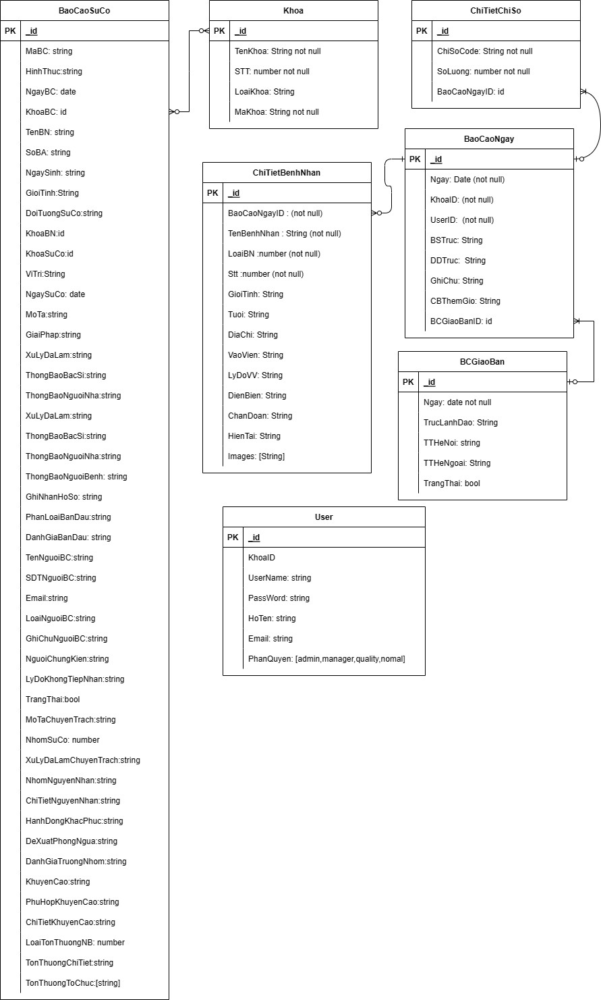

# How to set up and run the API locally

npm i
add file .env
PORT=8020

MONGODB_URI ="mongodb://127.0.0.1:27017/giaoban_bvt"

JWT_SECRET_KEY ="DFSDFSD"

npm run start

# How to consume the API

## Endpoint APIs

### Auth APIs

```javascript
/**
 * @route POST /auth/login  Login with username and password
 * @description  Login with username and password
 * @body {UserName,PassWord}
 * @access Public
 */
```

### User APIs

```javascript
/**
 * @route POST /user
 * @description  Insert a new account
 * @body {UserName,Email,PassWord,KhoaID,HoTen,PhanQuyen}
 * @access Admin require
 */

/**
 * @route GET /user
 * @description  get all user
 * @params { page, limit, ...filter }
 * @access Admin require
 */

/**
 *@route GET /users/me
 * @description  Get current user info
 * @params  userId
 * @access Login required
 */

/**
 * @route PUT /user/:id
 * @description  Update a account
 * @body {UserName,Email,PassWord,KhoaID,HoTen,PhanQuyen}
 * @access Admin require
 */

/**
 * @route PUT /user/resetpass/:id
 * @description  reset pass
 * @body {PassWord}
 * @access Admin require
 */

/**
 * @route PUT /user/me/resetpass/
 * @description  reset pass curent user
 * @body {PassWord}
 * @access Login require
 */

/**
 * @route DELETE /user/:id
 * @description  Delete a user
 * @access Admin required
 */
```

### Khoa APIs

```javascript
/**
 * @route POST /khoa
 * @description Insert a new Khoa
 * @body {TenKhoa,LoaiKhoa,STT,MaKhoa}
 * @access
 */

/**
 * @route GET /khoa
 * @description get all Khoa
 * @access
 */
```

### BCGiaoBan

```javascript
/**
 * @route POST /bcgiaoban
 * @description Insert a new bcgiaoban
 * @body {Ngay,TTHeNoi,TTHeNgoai,TrangThai}
 * @access login require,
 */

/**
 * @route GET /bcgiaoban/allbyngay
 * @description get bcgiaoban by fromDate toDate
 * @params {fromDate, toDate}
 * @access login require,
 */

/**
 * @route POST /bcgiaoban/allbyngay
 * @description update or insert bcgiaoban by fromDate,toDate
 * @body [bcgiaobans]
 * @access login require,
 */

/**
 * @route POST /bcgiaoban/trangthai
 * @description update trangthai for bcgiaoban by date,trangthai
 * @body {ngay,trangthai}
 * @access login require,
 */
```

### BaoCaoNGay

```javascript
/**
 * @route POST /baocaongay
 * @description Insert or Update a new baocaongay
 * @body { Ngay,KhoaID,BaoCaoNgay}
 * @access  login require,
 */

/**
 * @route GET /baocaongay
 * @description Get one baocaongay
 * @params { Ngay,KhoaID}
 * @access  login require,
 */

/**
 * @route GET /baocaongay/all
 * @description Get all baocaongay in one day
 * @params { Ngay}
 * @access  login require,
 */
```

### BaoCaoSuCo

````javascript
/**
 * @route POST /baocaosuco
 * @description Insert  new baocaosuco
 * @body {baocaosuco}
 * @access  login require,
 */

### Backup & Restore (NEW)
```javascript
/**
 * @route GET /backup/download
 * @description Tạo mới và tải về 1 file backup (.zip) dùng mongodump
 * @access Admin required
 */
/**
 * @route GET /backup/download?f=<filename>
 * @description Tải lại file backup đã có trong thư mục _backups
 * @access Admin required
 */
/**
 * @route GET /backup/list
 * @description Liệt kê các file backup hiện có
 * @access Admin required
 */
/**
 * @route POST /backup/restore (multipart/form-data, field "file")
 * @description Phục hồi dữ liệu từ file backup zip (mongorestore --drop)
 * @access Admin required
 */
````

Lưu ý vận hành:

- Cần cài MongoDB Database Tools (mongodump, mongorestore) trên server.
- Thư mục lưu: `_backups/` (cần dọn dẹp định kỳ hoặc chuyển sang object storage).
- Restore dùng cờ --drop nên xóa dữ liệu hiện có trước khi nạp.
- Khuyến cáo kiểm thử file backup trên môi trường staging trước khi restore production.

/\*\*

- @route GET /baocaosuco
- @description Get all baocaosuco

- @access login require,
  \*/

/\*\*

- @route GET /baocaosuco
- @description Get all baocaongay in one day
- @params { Ngay}
- @access login require,
  \*/

/\*\*

- @route GET /baocaosuco/tonghop
- @description Get báo cáo tổng hợp cho chart
- @params { fromDate, toDate}
- @access login require,
  \*/
  /\*\*
- @route GET /baocaosuco/tonghoptheokhoa
- @description Get báo cáo tổng hợp theo khoa
- @params { fromDate, toDate}
- @access login require,
  \*/

/\*\*

- @route GET /baocaosuco/:sucoId
- @description Get one baocaosuco
- @params {sucoId}
- @access login require,
  \*/
  /\*\*
- @route DELETE /baocaosuco/:sucoId
- @description DELETE one baocaosuco
- @params {sucoId}
- @access login require,
  \*/
  /\*\*
- @route PUT /baocaosuco/:sucoId
- @description update one baocaosuco
- @body {baocaosuco}
- @access login require,
  \*/
  /\*\*
- @route PUT /baocaosuco/updatetrangthai
- @description update trang thai for one baocaosuco
- @body {sucoId, trangthai}
- @access login require,
  \*/

```


# ERD


```
