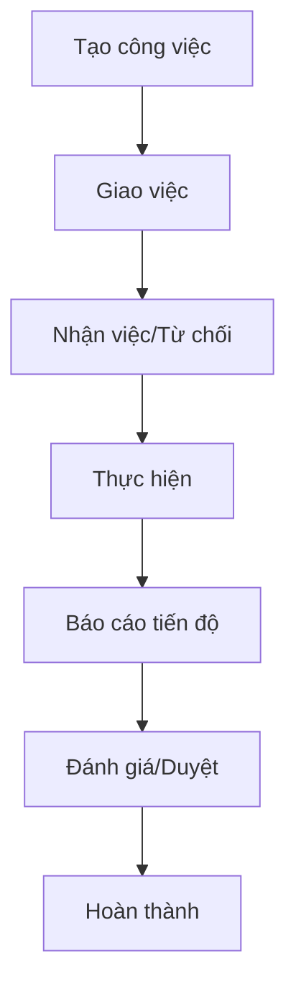

# PHÂN TÍCH NGHIỆP VỤ - MODULE QUẢN LÝ CÔNG VIỆC
**Dự án:** Hệ thống quản lý công việc Bệnh viện Phú Thọ  
**Ngày tạo:** [Ngày hiện tại]  
**Phiên bản:** 1.0

## 1. TỔNG QUAN NGHIỆP VỤ

### 1.1 Mục tiêu
Xây dựng hệ thống quản lý công việc số hóa cho Bệnh viện Phú Thọ, giúp:
- Tự động hóa quy trình giao việc và theo dõi tiến độ
- Tăng cường minh bạch trong quản lý công việc
- Cải thiện hiệu quả làm việc và trách nhiệm cá nhân
- Tạo cơ sở dữ liệu để đánh giá KPI trong tương lai

### 1.2 Phạm vi áp dụng
- **Đối tượng:** Toàn bộ bệnh viện (~50 phòng ban)
- **Người dùng:** Giám đốc, Trưởng phòng, Nhân viên
- **Loại công việc:** Cá nhân và nhóm

## 2. PHÂN TÍCH CƠ CẤU TỔ CHỨC

### 2.1 Cấp bậc quản lý
```
Giám đốc (1)
├── Trưởng phòng (~50)
    ├── Nhân viên (nhiều)
```

### 2.2 Phân quyền hệ thống
| Vai trò | Quyền hạn |
|---------|-----------|
| **Giám đốc** | Giao việc cho Trưởng phòng, xem báo cáo tổng thể, quản trị hệ thống |
| **Trưởng phòng** | Giao việc cho nhân viên, đánh giá công việc, báo cáo lên Giám đốc |
| **Nhân viên** | Nhận việc, thực hiện, báo cáo tiến độ, comment |

## 3. QUY TRÌNH NGHIỆP VỤ

### 3.1 Quy trình giao việc


### 3.2 Chi tiết quy trình

#### 3.2.1 Tạo và giao việc
1. **Người giao việc** tạo công việc mới với thông tin:
   - Tiêu đề, mô tả chi tiết
   - Người thực hiện (cá nhân/nhóm)
   - Thời gian bắt đầu, deadline
   - Độ ưu tiên, loại công việc
   - File đính kèm (tài liệu, hình ảnh)

2. **Hệ thống** gửi thông báo đến người được giao
3. **Người nhận** có thể:
   - Nhận việc và bắt đầu thực hiện
   - Từ chối với lý do cụ thể

#### 3.2.2 Thực hiện công việc
1. **Người thực hiện** cập nhật:
   - Trạng thái công việc
   - Báo cáo tiến độ (%)
   - Comment, file đính kèm
   - Thời gian thực tế

2. **Hệ thống** tự động:
   - Gửi thông báo khi có cập nhật
   - Cảnh báo khi gần deadline
   - Đánh dấu quá hạn nếu cần

#### 3.2.3 Đánh giá và hoàn thành
1. **Người giao việc** đánh giá:
   - Mức độ hoàn thành
   - Chất lượng công việc
   - Feedback/Comment

2. **Trạng thái cuối:** Hoàn thành/Cần chỉnh sửa

## 4. CÁC TÍNH NĂNG CHÍNH

### 4.1 Quản lý công việc
- ✅ Tạo/Sửa/Xóa công việc
- ✅ Giao việc cho cá nhân/nhóm
- ✅ Đính kèm file (tài liệu, hình ảnh)
- ✅ Theo dõi trạng thái và tiến độ
- ✅ Đánh giá và phê duyệt

### 4.2 Hệ thống thông báo
- 🔔 Giao việc mới
- 🔔 Cập nhật tiến độ
- 🔔 Comment mới
- 🔔 Sắp đến hạn/Quá hạn
- 🔔 Hoàn thành công việc

### 4.3 Tương tác và giao tiếp
- 💬 Hệ thống comment theo công việc
- 📎 Đính kèm file trong comment
- 👥 Tag người liên quan
- 📋 Lịch sử thay đổi

### 4.4 Báo cáo và thống kê
- 📊 Dashboard cá nhân
- 📈 Báo cáo theo phòng ban
- ⏱️ Thống kê thời gian làm việc
- 🎯 Tỷ lệ hoàn thành công việc

### 4.5 Template và tự động hóa
- 📝 Template công việc lặp lại
- ⚡ Tự động tạo công việc định kỳ
- 🏷️ Phân loại và gắn tag

## 5. TRẠNG THÁI CÔNG VIỆC

| Trạng thái | Mô tả | Người thay đổi |
|------------|-------|----------------|
| **Mới tạo** | Công việc vừa được tạo | Hệ thống |
| **Đã giao** | Đã giao cho người thực hiện | Người giao việc |
| **Đã nhận** | Người thực hiện đã nhận việc | Người thực hiện |
| **Từ chối** | Từ chối nhận việc | Người thực hiện |
| **Đang thực hiện** | Đang trong quá trình làm | Người thực hiện |
| **Chờ duyệt** | Đã hoàn thành, chờ phê duyệt | Người thực hiện |
| **Hoàn thành** | Đã được duyệt và hoàn thành | Người giao việc |
| **Quá hạn** | Vượt quá deadline | Hệ thống |
| **Tạm dừng** | Tạm thời dừng thực hiện | Người thực hiện |

## 6. PHÂN LOẠI CÔNG VIỆC

### 6.1 Theo độ ưu tiên
- 🔴 **Khẩn cấp:** Cần hoàn thành ngay
- 🟡 **Cao:** Ưu tiên cao
- 🟢 **Trung bình:** Ưu tiên thông thường  
- ⚪ **Thấp:** Có thể hoãn lại

### 6.2 Theo loại công việc
- **Thường xuyên:** Công việc hàng ngày
- **Đột xuất:** Phát sinh đột ngột
- **Dự án:** Thuộc một dự án lớn
- **Báo cáo:** Các loại báo cáo định kỳ
- **Kiểm tra:** Công tác kiểm tra, giám sát

## 7. TÍCH HỢP TƯƠNG LAI

### 7.1 Module KPI (Giai đoạn 2)
- Đánh giá KPI dựa trên dữ liệu công việc
- Thiết lập tiêu chí KPI theo vị trí
- Báo cáo KPI định kỳ

### 7.2 Tích hợp khác
- Hệ thống nhân sự
- Email/SMS thông báo
- Ứng dụng mobile

## 8. KẾT LUẬN

Module quản lý công việc sẽ là nền tảng quan trọng giúp số hóa quy trình làm việc tại Bệnh viện Phú Thọ. Hệ thống được thiết kế linh hoạt, dễ mở rộng và phù hợp với đặc thù của môi trường y tế.

**Lợi ích kỳ vọng:**
- Tăng 30% hiệu quả quản lý công việc
- Giảm 50% thời gian theo dõi thủ công
- Tạo cơ sở dữ liệu đáng tin cậy cho đánh giá KPI
- Cải thiện trách nhiệm và minh bạch trong công việc