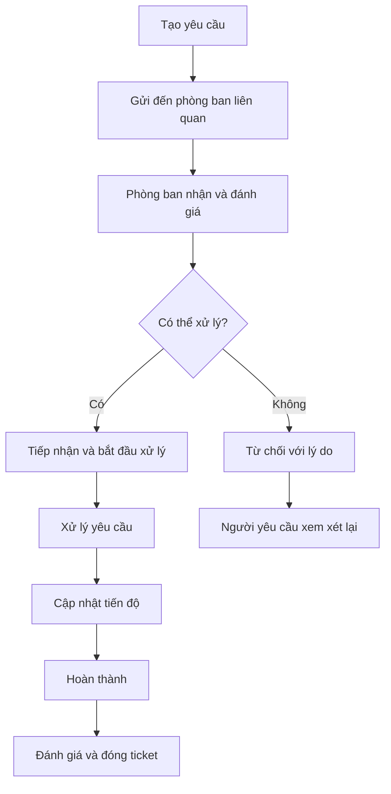

## 9. HỆ THỐNG YÊU CẦU PHỐI HỢP (TICKET SYSTEM)

### 9.1 Tổng quan
Hệ thống ticket cho phép các phòng ban/nhân viên gửi yêu cầu hỗ trợ, phối hợp công việc đến các phòng ban chuyên môn khác một cách có tổ chức và theo dõi được.

### 9.2 Các loại yêu cầu phổ biến trong bệnh viện

#### 9.2.1 Phòng Công nghệ thông tin (IT)
- 🖥️ Sửa chữa máy tính, máy in
- 🌐 Sự cố mạng internet, hệ thống
- 💾 Cài đặt/cập nhật phần mềm
- 🔐 Cấp quyền truy cập hệ thống
- 📱 Hỗ trợ thiết bị di động, tablet

#### 9.2.2 Phòng Kỹ thuật/Bảo trì
- ⚡ Sự cố điện, điều hòa
- 🔧 Sửa chữa trang thiết bị y tế
- 🏗️ Sửa chữa cơ sở hạ tầng
- 🚿 Hệ thống nước, vệ sinh
- 🔒 Khóa, cửa, bảo mật

#### 9.2.3 Phòng Tài chính - Kế toán
- 💰 Thanh toán, tạm ứng
- 📊 Báo cáo tài chính
- 🧾 Quyết toán, hoàn ứng
- 📋 Duyệt ngân sách

#### 9.2.4 Phòng Nhân sự
- 👥 Tuyển dụng, điều động
- 📄 Xử lý hồ sơ nhân viên
- 🎓 Đào tạo, bồi dưỡng
- ⚖️ Xử lý kỷ luật

#### 9.2.5 Phòng Hành chính - Tổng vụ
- 📦 Mua sắm, cung cấp vật tư
- 🚗 Xe công, vận chuyển
- 📞 Dịch vụ điện thoại, fax
- 🏢 Quản lý cơ sở vật chất

### 9.3 Quy trình xử lý ticket



### 9.4 Thông tin chi tiết ticket

#### 9.4.1 Khi tạo yêu cầu
```json
{
  "ticketInfo": {
    "tieuDe": "Yêu cầu sửa máy tính phòng Khám tim mạch",
    "loaiYeuCau": "IT - Sửa chữa thiết bị",
    "mucDoUuTien": "Cao", // Thấp, Trung bình, Cao, Khẩn cấp
    "phongBanYeuCau": "Phòng Khám tim mạch",
    "nguoiYeuCau": "Nguyễn Văn A",
    "phongBanXuLy": "Phòng Công nghệ thông tin",
    "moTaChiTiet": "Máy tính số 3 không khởi động được, màn hình không hiển thị",
    "diaDiem": "Phòng 201 - Tòa A",
    "thoiGianMongMuon": "2024-01-15 14:00",
    "mucDoAnhHuong": "Cao", // Ảnh hưởng đến công việc
    "filesDinhKem": ["hinh_anh_su_co.jpg"],
    "ghiChu": "Cần xử lý gấp vì ảnh hưởng khám bệnh"
  }
}
```

#### 9.4.2 Phân loại mức độ ưu tiên
| Mức độ | Thời gian phản hồi | Thời gian xử lý | Mô tả |
|--------|-------------------|-----------------|-------|
| **Khẩn cấp** | 15 phút | 2 giờ | Ảnh hưởng nghiêm trọng, dừng hoạt động |
| **Cao** | 1 giờ | 4 giờ | Ảnh hưởng lớn đến công việc |
| **Trung bình** | 4 giờ | 1-2 ngày | Ảnh hưởng một phần |
| **Thấp** | 1 ngày | 3-5 ngày | Ảnh hưởng nhỏ, có thể hoãn |

### 9.5 Trạng thái ticket

| Trạng thái | Mô tả | Người thay đổi |
|------------|-------|----------------|
| **Mới tạo** | Ticket vừa được tạo | Hệ thống |
| **Đã gửi** | Đã gửi đến phòng ban xử lý | Hệ thống |
| **Đã tiếp nhận** | Phòng ban đã xác nhận nhận | Phòng ban xử lý |
| **Từ chối** | Không thể xử lý, có lý do | Phòng ban xử lý |
| **Đang xử lý** | Đang trong quá trình giải quyết | Phòng ban xử lý |
| **Chờ phản hồi** | Cần thêm thông tin từ người yêu cầu | Phòng ban xử lý |
| **Hoàn thành** | Đã xử lý xong | Phòban xử lý |
| **Đã đóng** | Người yêu cầu xác nhận OK | Người yêu cầu |
| **Mở lại** | Mở lại do chưa giải quyết triệt để | Người yêu cầu |

### 9.6 Template yêu cầu theo loại

#### 9.6.1 Template IT
```markdown
**Loại sự cố:** [ ] Phần cứng [ ] Phần mềm [ ] Mạng [ ] Bảo mật
**Thiết bị:** _____________________
**Mô tả sự cố:** _____________________
**Thời điểm xảy ra:** _____________________
**Đã thử khắc phục:** [ ] Có [ ] Không
**Mức độ ảnh hưởng:** [ ] Dừng hoàn toàn [ ] Chậm trễ [ ] Khó khăn nhỏ
```

#### 9.6.2 Template Kỹ thuật
```markdown
**Loại yêu cầu:** [ ] Sửa chữa [ ] Bảo trì [ ] Lắp đặt
**Thiết bị/Hạng mục:** _____________________
**Vị trí:** _____________________
**Mô tả tình trạng:** _____________________
**Yêu cầu khẩn cấp:** [ ] Có [ ] Không
**Thời gian mong muốn:** _____________________
```

### 9.7 Dashboard và báo cáo ticket

#### 9.7.1 Dashboard cho người yêu cầu
- 📊 Tổng số ticket đã tạo
- ⏱️ Thời gian xử lý trung bình
- 📈 Tỷ lệ giải quyết thành công
- 🔄 Ticket đang xử lý

#### 9.7.2 Dashboard cho phòng ban xử lý
- 📥 Ticket chờ xử lý
- ⚡ Ticket khẩn cấp
- 📊 Thống kê theo loại yêu cầu
- ⏰ SLA (Service Level Agreement)

#### 9.7.3 Dashboard tổng quan (Giám đốc)
- 📈 Báo cáo hiệu suất phòng ban
- 🎯 Tỷ lệ đáp ứng SLA
- 📊 Các vấn đề thường gặp
- 💰 Chi phí xử lý ticket

### 9.8 Tính năng nâng cao

#### 9.8.1 Tự động phân loại
- AI phân loại ticket dựa trên nội dung
- Tự động gán cho nhân viên phù hợp
- Đề xuất giải pháp dựa trên lịch sử

#### 9.8.2 Escalation (Leo thang)
- Tự động leo thang khi quá SLA
- Thông báo cho cấp quản lý cao hơn
- Chuyển ticket sang phòng ban khác nếu cần

#### 9.8.3 Knowledge Base
- Cơ sở dữ liệu giải pháp
- FAQ cho các vấn đề thường gặp
- Hướng dẫn tự khắc phục

### 9.9 Tích hợp với hệ thống giao việc

#### 9.9.1 Chuyển đổi ticket thành công việc
- Ticket phức tạp có thể tạo thành dự án
- Giao việc cho nhiều người trong team
- Theo dõi tiến độ chi tiết

#### 9.9.2 Liên kết dữ liệu
- Ticket liên quan đến công việc
- Chia sẻ tài liệu, hình ảnh
- Comment chung giữa ticket và công việc

### 9.10 Thông báo và nhắc nhở

#### 9.10.1 Thông báo tự động
- 🔔 Ticket mới được tạo
- ⏰ Sắp quá SLA
- ✅ Ticket được xử lý
- 📝 Có comment/cập nhật mới

#### 9.10.2 Báo cáo định kỳ
- 📧 Email báo cáo hàng tuần
- 📊 Báo cáo tháng cho lãnh đạo
- 📈 Xu hướng và phân tích

### 9.11 SLA (Service Level Agreement) đề xuất

| Loại yêu cầu | Phản hồi | Giải quyệt | Ghi chú |
|--------------|----------|-------------|---------|
| **IT - Khẩn cấp** | 15 phút | 2 giờ | Hệ thống core, sự cố nghiêm trọng |
| **IT - Thường** | 2 giờ | 1 ngày | Sửa máy tính, phần mềm |
| **Kỹ thuật - Khẩn cấp** | 30 phút | 4 giờ | Điện, nước, thiết bị y tế |
| **Kỹ thuật - Thường** | 4 giờ | 2 ngày | Sửa chữa nhỏ |
| **Hành chính** | 1 ngày | 3 ngày | Mua sắm, thủ tục |
| **Nhân sự** | 2 ngày | 5 ngày | Hồ sơ, đào tạo |