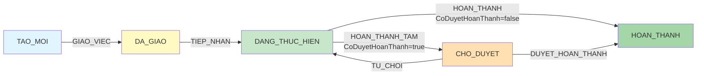

# 📘 CongViec Service & API Documentation

> **Module**: Work Management (Quản Lý Công Việc)  
> **Service File**: `modules/workmanagement/services/congViec.service.js`  
> **Routes File**: `modules/workmanagement/routes/congViec.api.js`  
> **Model File**: `modules/workmanagement/models/CongViec.js`  
> **Last Updated**: November 7, 2025

---

## 📑 Table of Contents

1. [Model Schema Overview](#1-model-schema-overview)
2. [Service Functions Reference](#2-service-functions-reference)
3. [API Routes Map](#3-api-routes-map)
4. [Response Structures](#4-response-structures)
5. [State Machine & Workflows](#5-state-machine--workflows)
6. [Common Patterns](#6-common-patterns)

---

## 1. Model Schema Overview

### 🗂️ CongViec Model Structure

```javascript
{
  // === Identification ===
  _id: ObjectId,
  MaCongViec: String,           // "CV00001" (unique, auto-generated)
  SoThuTu: Number,              // Sequence number for sorting

  // === Basic Info ===
  TieuDe: String,               // Title (required, max 255)
  MoTa: String,                 // Description (max 5000)

  // === People ===
  NguoiGiaoViecID: ObjectId,    // ref: NhanVien (người giao việc)
  NguoiChinhID: ObjectId,       // ref: NhanVien (người xử lý chính)
  NguoiThamGia: [               // Danh sách người tham gia
    {
      NhanVienID: ObjectId,     // ref: NhanVien
      VaiTro: String,           // "CHINH" | "PHOI_HOP"
      TrangThai: String,        // "TAO_MOI" | "DA_GIAO" | ...
      TienDo: Number,           // 0-100
      GhiChu: String
    }
  ],

  // === Priority & Dates ===
  MucDoUuTien: String,          // "THAP" | "BINH_THUONG" | "CAO" | "KHAN_CAP"
  NgayBatDau: Date,
  NgayHetHan: Date,

  // === Flow Milestones ===
  NgayGiaoViec: Date,           // Thời điểm giao việc (DA_GIAO)
  NgayCanhBao: Date,            // Ngày cảnh báo sắp hết hạn
  NgayTiepNhanThucTe: Date,     // Thời điểm tiếp nhận
  NgayHoanThanhTam: Date,       // Thời điểm hoàn thành tạm (CHO_DUYET)
  NgayHoanThanh: Date,          // Thời điểm hoàn thành chính thức

  // === Warning Config ===
  CanhBaoMode: String,          // "FIXED" | "PERCENT" | null
  CanhBaoSapHetHanPercent: Number, // 0.5 - 1.0 (for PERCENT mode)

  // === Status & Progress ===
  TrangThai: String,            // "TAO_MOI" | "DA_GIAO" | "DANG_THUC_HIEN" | "CHO_DUYET" | "HOAN_THANH"
  PhanTramTienDoTong: Number,   // 0-100
  CoDuyetHoanThanh: Boolean,    // Có cần duyệt hoàn thành không

  // === Late Tracking ===
  SoGioTre: Number,             // Số giờ trễ (calculated)
  HoanThanhTreHan: Boolean,     // Có hoàn thành trễ không
  FirstSapQuaHanAt: Date,       // Lần đầu chuyển sang "sắp quá hạn"
  FirstQuaHanAt: Date,          // Lần đầu chuyển sang "quá hạn"

  // === Task Hierarchy (Subtasks) ===
  CongViecChaID: ObjectId,      // ref: CongViec (parent task)
  Path: [ObjectId],             // Array of ancestor IDs (root -> parent)
  Depth: Number,                // 0 = root, 1 = level 1, ...
  ChildrenCount: Number,        // Số lượng subtasks trực tiếp

  // === Categorization ===
  NhomViecUserID: ObjectId,     // ref: NhomViecUser (custom group)
  NhiemVuThuongQuyID: ObjectId, // ref: NhiemVuThuongQuy (routine task template)
  FlagNVTQKhac: Boolean,        // Đánh dấu "Khác" (not from template)

  // === History ===
  LichSuTrangThai: [            // State change history
    {
      HanhDong: String,         // "GIAO_VIEC" | "TIEP_NHAN" | ...
      NguoiThucHienID: ObjectId,
      TuTrangThai: String,
      DenTrangThai: String,
      ThoiGian: Date,
      GhiChu: String,
      IsRevert: Boolean,        // Có phải revert action không
      ResetFields: [String],    // Các field bị reset
      Snapshot: {               // Snapshot tại completion
        SoGioTre: Number,
        HoanThanhTreHan: Boolean,
        TrangThaiBefore: String,
        TrangThaiAfter: String
      }
    }
  ],

  LichSuTienDo: [               // Progress history
    {
      Tu: Number,               // From %
      Den: Number,              // To %
      ThoiGian: Date,
      NguoiThucHienID: ObjectId,
      GhiChu: String
    }
  ],

  // === Related ===
  BinhLuans: [ObjectId],        // ref: BinhLuan

  // === System ===
  isDeleted: Boolean,           // Soft delete
  createdAt: Date,
  updatedAt: Date
}
```

### 🔄 State Machine



---

## 2. Service Functions Reference

### 📋 Core CRUD Operations

#### `service.createCongViec(congViecData, req)`

**Purpose**: Tạo công việc mới

**Parameters**:

- `congViecData` (Object): Dữ liệu công việc
  - `TieuDe` (String, required)
  - `MoTa` (String)
  - `NgayBatDau` (Date, required)
  - `NgayHetHan` (Date, required)
  - `MucDoUuTien` (String): "Thấp" | "Bình thường" | "Cao" | "Rất cao"
  - `NguoiChinh` (ObjectId, required): ID người thực hiện chính
  - `NguoiThamGia` (Array): Danh sách người tham gia
  - `NhomViecUserID` (ObjectId): Nhóm việc
  - `CoDuyetHoanThanh` (Boolean): Có cần duyệt không
  - `CanhBaoMode` (String): "FIXED" | "PERCENT"
  - `CanhBaoSapHetHanPercent` (Number): 0.5 - 0.99
  - `CongViecChaID` (ObjectId): Parent task (for subtasks)
- `req` (Object): Express request object
  - `req.userId` (ObjectId): User ID from JWT token

**Logic Flow**:

```
1. Validate required fields (TieuDe, NgayBatDau, NgayHetHan, NguoiChinh)
2. Validate NgayHetHan > NgayBatDau
3. Check NguoiChinh exists in NhanVien
4. Build NguoiThamGia array:
   - Ensure exactly one "CHINH" role = NguoiChinh
   - Others are "PHOI_HOP"
5. Convert frontend labels to backend enums:
   - Priority: "Thấp" → "THAP", etc.
   - Status: "Mới" → "TAO_MOI", etc.
6. Resolve NguoiGiaoViecID from req.userId:
   - Query User by req.userId
   - Get user.NhanVienID
7. Generate MaCongViec:
   - Use Counter collection (atomic increment)
   - Format: CV{padded_seq} (e.g., "CV00001")
8. Calculate NgayCanhBao based on CanhBaoMode
9. Save to database
10. Populate and return DTO
```

**Response Structure**:

```javascript
{
  _id: "...",
  MaCongViec: "CV00001",
  SoThuTu: 1,
  TieuDe: "...",
  MoTa: "...",
  NgayBatDau: "2025-11-01T00:00:00.000Z",
  NgayHetHan: "2025-11-30T23:59:59.999Z",
  NgayCanhBao: "2025-11-24T00:00:00.000Z",
  MucDoUuTien: "BINH_THUONG",
  TrangThai: "TAO_MOI",
  PhanTramTienDoTong: 0,

  // Populated references
  NguoiGiaoViec: {
    _id: "...",
    Ten: "Nguyễn Văn A",
    Email: "nvana@example.com",
    KhoaID: { _id: "...", TenKhoa: "Khoa Nội", MaKhoa: "NOI" }
  },
  NguoiChinh: {
    _id: "...",
    Ten: "Trần Thị B",
    Email: "ttb@example.com",
    KhoaID: { _id: "...", TenKhoa: "Khoa Ngoại", MaKhoa: "NGOAI" }
  },
  NguoiThamGia: [
    {
      NhanVienID: {
        _id: "...",
        Ten: "Trần Thị B",
        Email: "ttb@example.com"
      },
      VaiTro: "CHINH",
      TienDo: 0
    }
  ],
  NhomViecUserID: {
    _id: "...",
    TenNhom: "Dự án ABC",
    MoTa: "..."
  },

  CoDuyetHoanThanh: false,
  ChildrenCount: 0,
  Depth: 0,
  Path: [],

  createdAt: "2025-11-07T10:00:00.000Z",
  updatedAt: "2025-11-07T10:00:00.000Z"
}
```

---

#### `service.updateCongViec(id, updateData, req)`

**Purpose**: Cập nhật công việc

**Parameters**:

- `id` (String): CongViec ID
- `updateData` (Object): Dữ liệu cần cập nhật
  - Cho phép update: TieuDe, MoTa, NgayBatDau, NgayHetHan, MucDoUuTien, NguoiChinh, NguoiThamGia, CanhBao settings, NhomViecUserID, NhiemVuThuongQuyID, FlagNVTQKhac
  - **KHÔNG** cho phép update trực tiếp: TrangThai (dùng transition), PhanTramTienDoTong (dùng updateProgress)
- `req` (Object): Express request object

**Logic Flow**:

```
1. Find CongViec by ID (isDeleted != true)
2. Validate not completed (TrangThai != "HOAN_THANH")
3. Validate dates if changed (NgayHetHan > NgayBatDau)
4. Handle NguoiChinh change:
   - Update NguoiChinhID
   - Rebuild NguoiThamGia ensuring new CHINH
5. Update allowed fields
6. Recalculate NgayCanhBao if dates/mode changed
7. Save and return populated DTO
```

**Response**: Same structure as `createCongViec`

---

#### `service.getCongViecDetail(id)`

**Purpose**: Lấy chi tiết công việc kèm bình luận

**Parameters**:

- `id` (String): CongViec ID

**Response Structure**:

```javascript
{
  congViec: {
    // Full CongViec object (populated)
    _id: "...",
    MaCongViec: "CV00001",
    TieuDe: "...",
    // ... all fields from model
    NguoiGiaoViec: { /* populated */ },
    NguoiChinh: { /* populated */ },
    NguoiThamGia: [{ NhanVienID: { /* populated */ }, VaiTro: "...", ... }],
    NhomViecUserID: { /* populated */ },

    // Virtual field
    BinhLuans: [
      {
        _id: "...",
        NoiDung: "Bình luận 1",
        NguoiTao: {
          _id: "...",
          Ten: "Nguyễn Văn A",
          Email: "nvana@example.com"
        },
        CongViecID: "...",
        createdAt: "2025-11-07T10:00:00.000Z",
        TepTins: [
          {
            _id: "...",
            FileName: "document.pdf",
            FileUrl: "https://cloudinary.com/...",
            FileSize: 1024000,
            MimeType: "application/pdf"
          }
        ]
      }
    ]
  }
}
```

---

#### `service.deleteCongViec(id)`

**Purpose**: Xóa mềm công việc

**Logic**:

```
1. Set isDeleted = true
2. Soft delete all child tasks recursively
3. Soft delete all related BinhLuans
4. Soft delete all TepTins (set TrangThai = "DELETED")
```

---

### 🔄 State Transition Functions

#### `service.transition(id, payload, req)`

**Purpose**: Unified state transition endpoint (thay thế các hàm giaoViec, tiepNhan, hoanThanh, duyetHoanThanh)

**Parameters**:

- `id` (String): CongViec ID
- `payload` (Object):
  - `action` (String, required): "GIAO_VIEC" | "TIEP_NHAN" | "HOAN_THANH" | "HOAN_THANH_TAM" | "DUYET_HOAN_THANH" | "TU_CHOI" | "REVERT"
  - `lyDo` (String): Lý do (for TU_CHOI, REVERT)
  - `ghiChu` (String): Ghi chú
- `req` (Object): Express request object
  - `req.userId` (ObjectId): For permission check

**Permission Matrix**:

| Action             | Required Role              | Current State                           |
| ------------------ | -------------------------- | --------------------------------------- |
| `GIAO_VIEC`        | NguoiGiaoViec (isAssigner) | TAO_MOI                                 |
| `TIEP_NHAN`        | NguoiChinh (isMain)        | DA_GIAO                                 |
| `HOAN_THANH`       | NguoiChinh                 | DANG_THUC_HIEN (CoDuyetHoanThanh=false) |
| `HOAN_THANH_TAM`   | NguoiChinh                 | DANG_THUC_HIEN (CoDuyetHoanThanh=true)  |
| `DUYET_HOAN_THANH` | NguoiGiaoViec              | CHO_DUYET                               |
| `TU_CHOI`          | NguoiGiaoViec              | CHO_DUYET                               |
| `REVERT`           | NguoiGiaoViec              | Any (except TAO_MOI)                    |

**Logic Flow**:

```
1. Load CongViec by ID
2. Normalize action:
   - If action=HOAN_THANH + CoDuyetHoanThanh=true + TrangThai=DANG_THUC_HIEN
     → Auto convert to HOAN_THANH_TAM
3. Resolve performerIdCtx from req.userId:
   - Query User.findById(req.userId)
   - Get user.NhanVienID
4. Check permission:
   - isAssigner = performerIdCtx === NguoiGiaoViecID
   - isMain = performerIdCtx === NguoiChinhID
   - Validate against ROLE_REQUIREMENTS[action]
5. Validate subtasks (if action = HOAN_THANH or DUYET_HOAN_THANH):
   - Count incomplete children
   - Throw error if any incomplete
6. Execute state mutation:
   - Update TrangThai
   - Set milestone dates (NgayGiaoViec, NgayHoanThanh, etc.)
   - Calculate SoGioTre, HoanThanhTreHan
   - Reset fields if action has reset list
7. Add to LichSuTrangThai
8. Recompute NgayCanhBao if needed
9. Save and return DTO
```

**Response Structure**:

```javascript
{
  congViec: {
    _id: "...",
    MaCongViec: "CV00001",
    TrangThai: "DA_GIAO",  // New state
    NgayGiaoViec: "2025-11-07T10:30:00.000Z",  // Milestone set
    NgayCanhBao: "2025-11-24T00:00:00.000Z",

    LichSuTrangThai: [
      {
        HanhDong: "GIAO_VIEC",
        NguoiThucHienID: "...",
        TuTrangThai: "TAO_MOI",
        DenTrangThai: "DA_GIAO",
        ThoiGian: "2025-11-07T10:30:00.000Z",
        GhiChu: "...",
        IsRevert: false
      }
    ],

    // ... other fields
  }
}
```

**Error Codes**:

- `403 FORBIDDEN`: Permission denied
- `403 NOT_MAIN`: Not the main performer
- `400`: Invalid action for current state
- `409 CHILDREN_INCOMPLETE`: Subtasks not completed yet

---

#### Legacy Functions (Deprecated, use `transition` instead)

- `service.giaoViec(id, payload, req)` → Use `transition(id, {action:"GIAO_VIEC"}, req)`
- `service.tiepNhan(id, req)` → Use `transition(id, {action:"TIEP_NHAN"}, req)`
- `service.hoanThanh(id, req)` → Use `transition(id, {action:"HOAN_THANH"}, req)`
- `service.duyetHoanThanh(id, req)` → Use `transition(id, {action:"DUYET_HOAN_THANH"}, req)`

---

### 📊 Query Functions

#### `service.getReceivedCongViecs(nhanVienId, filters, page, limit)`

**Purpose**: Lấy danh sách công việc mà nhân viên là người xử lý chính

**Parameters**:

- `nhanVienId` (String): NhanVien ID
- `filters` (Object):
  - `search` (String): Tìm theo TieuDe hoặc MoTa
  - `TrangThai` (String): Filter by state
  - `MucDoUuTien` (String): Filter by priority
  - `NgayBatDau` (Date): Filter from date
  - `NgayHetHan` (Date): Filter to date
  - `MaCongViec` (String): Filter by code
  - `NguoiChinhID` (String): Filter by main performer
- `page` (Number): Page number (1-based)
- `limit` (Number): Items per page

**Query Logic**:

```javascript
{
  NguoiChinhID: nhanVienId,
  isDeleted: { $ne: true },
  // + dynamic filters
}
```

**Response Structure**:

```javascript
{
  congViecs: [
    {
      _id: "...",
      MaCongViec: "CV00001",
      TieuDe: "...",
      TrangThai: "DANG_THUC_HIEN",
      MucDoUuTien: "CAO",
      NgayHetHan: "2025-11-30T23:59:59.999Z",
      PhanTramTienDoTong: 50,

      NguoiGiaoViec: { /* populated */ },
      NguoiChinh: { /* populated */ },
      NhomViecUserID: { /* populated */ },

      // Computed fields
      TinhTrangHan: "BINH_THUONG" | "SAP_HET_HAN" | "QUA_HAN",
      SoGioConLai: 120,
      // ...
    },
    // ...
  ],
  total: 50,
  page: 1,
  totalPages: 5
}
```

---

#### `service.getAssignedCongViecs(nhanVienId, filters, page, limit)`

**Purpose**: Lấy danh sách công việc mà nhân viên là người giao việc

**Query Logic**:

```javascript
{
  NguoiGiaoViecID: nhanVienId,
  isDeleted: { $ne: true },
  // + dynamic filters
}
```

**Response**: Same structure as `getReceivedCongViecs`

---

### 🌲 Tree/Hierarchy Functions

#### `service.createSubtask(parentId, data, req)`

**Purpose**: Tạo công việc con (subtask)

**Logic**:

```
1. Validate parentId
2. Check parent exists and not HOAN_THANH
3. Set data.CongViecChaID = parentId
4. Call createCongViec(data, req)
5. Pre-save hook will auto-calculate Path, Depth
6. Post-save hook will increment parent.ChildrenCount
```

---

#### `service.listChildren(parentId, page, limit)`

**Purpose**: Lấy danh sách công việc con trực tiếp

**Query**:

```javascript
{
  CongViecChaID: parentId,
  isDeleted: { $ne: true }
}
```

---

#### `service.getTreeRoot(id)`

**Purpose**: Tìm task gốc (root) của task hiện tại

**Logic**:

```
1. Load task
2. If Depth = 0 → return self
3. Else → return Path[0] (root ancestor)
```

---

#### `service.getTreeChildren(id, maxDepth)`

**Purpose**: Lấy tất cả con/cháu trong cây (breadth-first)

**Logic**:

```
1. Start with root node
2. Recursively load children level by level
3. Stop at maxDepth (default: 10)
4. Return flat array with depth info
```

---

#### `service.getFullTree(id)`

**Purpose**: Lấy toàn bộ cây từ root đến tất cả leaves

**Returns**: Nested tree structure

---

### 💬 Comment & Progress Functions

#### `service.addComment(congViecId, payload, req)`

**Purpose**: Thêm bình luận vào công việc

**Parameters**:

- `congViecId` (String)
- `payload` (Object):
  - `NoiDung` (String, required)
  - `ParentBinhLuanID` (ObjectId): For reply
- `req.userId` (ObjectId)

**Response**:

```javascript
{
  _id: "...",
  NoiDung: "Bình luận mới",
  NguoiTao: { /* populated */ },
  CongViecID: "...",
  ParentBinhLuanID: null,
  createdAt: "2025-11-07T11:00:00.000Z"
}
```

---

#### `service.updateProgress(id, payload, req)`

**Purpose**: Cập nhật tiến độ (thêm vào lịch sử)

**Parameters**:

- `payload` (Object):
  - `PhanTramTienDoTong` (Number, required): 0-100

**Logic**:

```
1. Validate 0 <= progress <= 100
2. Resolve performerId from req.userId
3. Add to LichSuTienDo: { Tu: old%, Den: new%, NguoiThucHienID, ThoiGian }
4. Update PhanTramTienDoTong
5. Save and return
```

---

### 🔧 Utility Functions

#### `service.getNhanVienById(nhanVienId)`

**Purpose**: Lấy thông tin nhân viên (populated with KhoaID)

---

#### `service.getMyRoutineTasks(nhanVienId)`

**Purpose**: Lấy danh sách nhiệm vụ thường quy của nhân viên

**Response**:

```javascript
[
  {
    _id: "...",
    TenNhiemVu: "Kiểm tra huyết áp",
    MoTa: "...",
    TanSuat: "DAILY",
    IsActive: true,
  },
];
```

---

## 3. API Routes Map

### 🗺️ Complete Routes Table

| Method     | Route                                        | Controller                  | Service                     | Description                    |
| ---------- | -------------------------------------------- | --------------------------- | --------------------------- | ------------------------------ |
| **GET**    | `/nhanvien/:nhanvienid`                      | `getNhanVien`               | `getNhanVienById`           | Lấy thông tin nhân viên        |
| **GET**    | `/congviec/:nhanvienid/received`             | `getReceivedCongViecs`      | `getReceivedCongViecs`      | Lấy công việc được giao        |
| **GET**    | `/congviec/:nhanvienid/assigned`             | `getAssignedCongViecs`      | `getAssignedCongViecs`      | Lấy công việc đã giao          |
| **GET**    | `/congviec/detail/:id`                       | `getCongViecDetail`         | `getCongViecDetail`         | Chi tiết công việc             |
| **POST**   | `/congviec`                                  | `createCongViec`            | `createCongViec`            | Tạo công việc mới              |
| **PUT**    | `/congviec/:id`                              | `updateCongViec`            | `updateCongViec`            | Cập nhật công việc             |
| **DELETE** | `/congviec/:id`                              | `deleteCongViec`            | `deleteCongViec`            | Xóa công việc                  |
| **POST**   | `/congviec/:id/transition`                   | `transition`                | `transition`                | Chuyển trạng thái (unified)    |
| **POST**   | `/congviec/:id/giao-viec`                    | `giaoViec`                  | `giaoViec`                  | ⚠️ Deprecated: Dùng transition |
| **POST**   | `/congviec/:id/tiep-nhan`                    | `tiepNhan`                  | `tiepNhan`                  | ⚠️ Deprecated: Dùng transition |
| **POST**   | `/congviec/:id/hoan-thanh`                   | `hoanThanh`                 | `hoanThanh`                 | ⚠️ Deprecated: Dùng transition |
| **POST**   | `/congviec/:id/duyet-hoan-thanh`             | `duyetHoanThanh`            | `duyetHoanThanh`            | ⚠️ Deprecated: Dùng transition |
| **POST**   | `/congviec/:id/progress`                     | `updateProgress`            | `updateProgress`            | Cập nhật tiến độ               |
| **POST**   | `/congviec/:id/comment`                      | `addComment`                | `addComment`                | Thêm bình luận                 |
| **POST**   | `/congviec/:id/subtasks`                     | `createSubtask`             | `createSubtask`             | Tạo công việc con              |
| **GET**    | `/congviec/:id/children`                     | `listChildrenCongViec`      | `listChildren`              | Danh sách con trực tiếp        |
| **GET**    | `/congviec/:id/tree-root`                    | `getTreeRoot`               | `getTreeRoot`               | Tìm task gốc                   |
| **GET**    | `/congviec/:id/tree-children`                | `getTreeChildren`           | `getTreeChildren`           | Lấy cây con                    |
| **GET**    | `/congviec/:id/full-tree`                    | `getFullTree`               | `getFullTree`               | Lấy toàn bộ cây                |
| **PUT**    | `/congviec/:id/history/:index/note`          | `updateHistoryNote`         | `updateHistoryNote`         | Sửa ghi chú lịch sử trạng thái |
| **PUT**    | `/congviec/:id/progress-history/:index/note` | `updateProgressHistoryNote` | `updateProgressHistoryNote` | Sửa ghi chú lịch sử tiến độ    |
| **DELETE** | `/binhluan/:id`                              | `deleteComment`             | `deleteComment`             | Xóa bình luận                  |
| **PATCH**  | `/binhluan/:id/text`                         | `recallCommentText`         | `recallCommentText`         | Thu hồi nội dung bình luận     |
| **GET**    | `/binhluan/:id/replies`                      | `listReplies`               | `listReplies`               | Lấy danh sách trả lời          |
| **GET**    | `/nhiemvuthuongquy/my`                       | inline handler              | `getMyRoutineTasks`         | Nhiệm vụ thường quy của tôi    |

---

## 4. Response Structures

### ✅ Success Response Format

```javascript
{
  success: true,
  data: {
    // Response data (structure varies by endpoint)
  },
  message: "Success message"
}
```

### ❌ Error Response Format

```javascript
{
  success: false,
  error: "Error message",
  errorType: "Permission Error" | "Validation Error" | ...,
  statusCode: 400 | 403 | 404 | 409 | 500
}
```

### 📦 Common DTO Structures

#### CongViec DTO (from `mapCongViecDTO`)

```javascript
{
  _id: ObjectId,
  MaCongViec: String,
  SoThuTu: Number,
  TieuDe: String,
  MoTa: String,

  // Populated people
  NguoiGiaoViec: {
    _id: ObjectId,
    Ten: String,
    Email: String,
    MaNhanVien: String,
    KhoaID: {
      _id: ObjectId,
      TenKhoa: String,
      MaKhoa: String
    },
    ChucDanh: String,
    ChucVu: String,
    Images: [String]
  },
  NguoiChinh: { /* same structure */ },
  NguoiThamGia: [
    {
      NhanVienID: { /* same structure */ },
      VaiTro: String,
      TrangThai: String,
      TienDo: Number,
      GhiChu: String
    }
  ],

  // Dates
  NgayBatDau: ISOString,
  NgayHetHan: ISOString,
  NgayGiaoViec: ISOString,
  NgayCanhBao: ISOString,
  NgayHoanThanh: ISOString,

  // Status & Priority
  TrangThai: String,
  MucDoUuTien: String,
  PhanTramTienDoTong: Number,

  // Warning config
  CanhBaoMode: String,
  CanhBaoSapHetHanPercent: Number,

  // Late tracking
  SoGioTre: Number,
  HoanThanhTreHan: Boolean,

  // Hierarchy
  CongViecChaID: ObjectId,
  Path: [ObjectId],
  Depth: Number,
  ChildrenCount: Number,

  // Group
  NhomViecUserID: {
    _id: ObjectId,
    TenNhom: String,
    MoTa: String
  },

  // Routine task link
  NhiemVuThuongQuyID: ObjectId,
  FlagNVTQKhac: Boolean,

  // Approval
  CoDuyetHoanThanh: Boolean,

  // History
  LichSuTrangThai: [
    {
      HanhDong: String,
      NguoiThucHienID: ObjectId,
      TuTrangThai: String,
      DenTrangThai: String,
      ThoiGian: ISOString,
      GhiChu: String,
      IsRevert: Boolean,
      ResetFields: [String],
      Snapshot: Object
    }
  ],
  LichSuTienDo: [
    {
      Tu: Number,
      Den: Number,
      ThoiGian: ISOString,
      NguoiThucHienID: ObjectId,
      GhiChu: String
    }
  ],

  // System
  createdAt: ISOString,
  updatedAt: ISOString
}
```

---

## 5. State Machine & Workflows

### 🔄 State Transition Rules

#### Action: `GIAO_VIEC`

- **From**: `TAO_MOI`
- **To**: `DA_GIAO`
- **Permission**: `isAssigner` (NguoiGiaoViec)
- **Side Effects**:
  - Set `NgayGiaoViec = now()`
  - Calculate and set `NgayCanhBao` based on CanhBaoMode
- **Validations**:
  - NgayHetHan must be set

#### Action: `TIEP_NHAN`

- **From**: `DA_GIAO`
- **To**: `DANG_THUC_HIEN`
- **Permission**: `isMain` (NguoiChinh)
- **Side Effects**:
  - Set `NgayTiepNhanThucTe = now()`

#### Action: `HOAN_THANH`

- **From**: `DANG_THUC_HIEN`
- **To**: `HOAN_THANH`
- **Permission**: `isMain`
- **Preconditions**:
  - `CoDuyetHoanThanh = false`
  - All subtasks must be `HOAN_THANH`
- **Side Effects**:
  - Set `NgayHoanThanh = now()`
  - Calculate `SoGioTre` (hours late)
  - Set `HoanThanhTreHan = true/false`
  - Create snapshot in LichSuTrangThai

#### Action: `HOAN_THANH_TAM`

- **From**: `DANG_THUC_HIEN`
- **To**: `CHO_DUYET`
- **Permission**: `isMain`
- **Preconditions**:
  - `CoDuyetHoanThanh = true`
  - All subtasks must be `HOAN_THANH`
- **Side Effects**:
  - Set `NgayHoanThanhTam = now()`

#### Action: `DUYET_HOAN_THANH`

- **From**: `CHO_DUYET`
- **To**: `HOAN_THANH`
- **Permission**: `isAssigner`
- **Side Effects**:
  - Set `NgayHoanThanh = now()`
  - Calculate late metrics
  - Create completion snapshot

#### Action: `TU_CHOI`

- **From**: `CHO_DUYET`
- **To**: `DANG_THUC_HIEN`
- **Permission**: `isAssigner`
- **Required**: `lyDo` (reason)
- **Side Effects**:
  - Reset `NgayHoanThanhTam = null`

#### Action: `REVERT`

- **From**: Any (except `TAO_MOI`)
- **To**: Previous state
- **Permission**: `isAssigner`
- **Side Effects**:
  - Pop last entry from `LichSuTrangThai`
  - Reset fields according to reversed action's reset list
  - Mark history entry as `IsRevert = true`

---

### 📈 Workflow Diagrams

#### Standard Flow (No Approval)

```
┌─────────────┐
│   TAO_MOI   │ (Created)
└──────┬──────┘
       │ GIAO_VIEC (Assigner)
       ▼
┌─────────────┐
│   DA_GIAO   │ (Assigned)
└──────┬──────┘
       │ TIEP_NHAN (Main)
       ▼
┌─────────────┐
│ DANG_THUC_  │ (In Progress)
│    HIEN     │
└──────┬──────┘
       │ HOAN_THANH (Main)
       ▼
┌─────────────┐
│ HOAN_THANH  │ (Completed)
└─────────────┘
```

#### Approval Flow

```
┌─────────────┐
│   TAO_MOI   │
└──────┬──────┘
       │ GIAO_VIEC
       ▼
┌─────────────┐
│   DA_GIAO   │
└──────┬──────┘
       │ TIEP_NHAN
       ▼
┌─────────────┐
│ DANG_THUC_  │
│    HIEN     │
└──────┬──────┘
       │ HOAN_THANH_TAM (Main)
       ▼
┌─────────────┐
│  CHO_DUYET  │ (Pending Approval)
└──────┬──────┘
       │
       ├─── DUYET_HOAN_THANH (Assigner) ──┐
       │                                   ▼
       │                            ┌─────────────┐
       │                            │ HOAN_THANH  │
       │                            └─────────────┘
       │
       └─── TU_CHOI (Assigner) ──────┐
                                      ▼
                              Back to DANG_THUC_HIEN
```

---

## 6. Common Patterns

### 🔐 Authentication & Permission

All routes require `authentication.loginRequired` middleware:

```javascript
// Middleware sets req.userId from JWT token
router.use(authentication.loginRequired);
```

Service functions requiring permission check:

```javascript
// 1. Resolve NhanVienID from userId
let performerIdCtx = null;
if (req?.userId) {
  const User = require("../../../models/User");
  const user = await User.findById(req.userId).select("NhanVienID").lean();
  if (!user) throw new AppError(404, "User not found");
  if (!user.NhanVienID)
    throw new AppError(400, "User chưa được liên kết với nhân viên");
  performerIdCtx = user.NhanVienID;
}

// 2. Check role
const isAssigner =
  performerIdCtx && String(congviec.NguoiGiaoViecID) === String(performerIdCtx);
const isMain =
  performerIdCtx && String(congviec.NguoiChinhID) === String(performerIdCtx);

// 3. Validate against action requirements
if (!isAssigner && !isMain) {
  throw new AppError(403, "FORBIDDEN", "Permission Error");
}
```

---

### 📅 Date Calculation Patterns

#### Calculate NgayCanhBao (Warning Date)

```javascript
function computeNgayCanhBao({
  mode,
  ngayBatDau,
  ngayHetHan,
  percent,
  fixedNgayCanhBao,
}) {
  if (mode === "PERCENT") {
    const start = ngayBatDau || new Date();
    const end = ngayHetHan;
    const duration = end - start;
    const warningTime = start.getTime() + duration * percent;
    return new Date(warningTime);
  } else if (mode === "FIXED") {
    return fixedNgayCanhBao;
  }
  return null;
}
```

#### Calculate Late Hours (SoGioTre)

```javascript
function calculateLateHours(ngayHoanThanh, ngayHetHan) {
  if (ngayHoanThanh > ngayHetHan) {
    const diffMs = ngayHoanThanh - ngayHetHan;
    return Math.ceil(diffMs / (1000 * 60 * 60)); // Convert to hours
  }
  return 0;
}
```

---

### 🔄 Populate Patterns

Standard populate for CongViec:

```javascript
await CongViec.findById(id)
  .populate({
    path: "NguoiGiaoViec",
    select: "Ten Email KhoaID MaNhanVien ChucDanh ChucVu Images",
    populate: { path: "KhoaID", select: "TenKhoa MaKhoa" },
  })
  .populate({
    path: "NguoiChinh",
    select: "Ten Email KhoaID MaNhanVien ChucDanh ChucVu Images",
    populate: { path: "KhoaID", select: "TenKhoa MaKhoa" },
  })
  .populate("NhomViecUserID", "TenNhom MoTa")
  .populate({
    path: "NguoiThamGia.NhanVienID",
    select: "Ten Email KhoaID MaNhanVien ChucDanh ChucVu Images",
    populate: { path: "KhoaID", select: "TenKhoa MaKhoa" },
  })
  .lean();
```

---

### 🗃️ Pagination Pattern

```javascript
const page = Math.max(1, parseInt(req.query.page) || 1);
const limit = Math.min(100, Math.max(1, parseInt(req.query.limit) || 10));
const skip = (page - 1) * limit;

const total = await CongViec.countDocuments(query);
const congViecs = await CongViec.find(query)
  .sort({ createdAt: -1 })
  .skip(skip)
  .limit(limit)
  .populate(...)
  .lean();

return {
  congViecs,
  total,
  page,
  totalPages: Math.ceil(total / limit)
};
```

---

### 🔢 Auto-increment Pattern (MaCongViec)

```javascript
const Counter = require("../models/Counter");

// Atomic increment
const counter = await Counter.findOneAndUpdate(
  { _id: "congviec" },
  { $inc: { seq: 1 } },
  { new: true, upsert: true }
);

const seqNum = counter.seq || 1;
const MaCongViec = `CV${String(seqNum).padStart(5, "0")}`;
// Result: CV00001, CV00002, ...
```

---

### 🌲 Tree Operations Pattern

#### Build Path for Subtask

```javascript
// Pre-save hook
congViecSchema.pre("save", async function (next) {
  if (this.isNew && this.CongViecChaID) {
    const parent = await this.constructor
      .findById(this.CongViecChaID)
      .select("Path Depth");
    if (parent) {
      this.Path = [...parent.Path, parent._id];
      this.Depth = parent.Depth + 1;
    }
  }
  next();
});
```

#### Increment Parent ChildrenCount

```javascript
// Post-save hook
congViecSchema.post("save", async function (doc) {
  if (doc.CongViecChaID) {
    await this.constructor.findByIdAndUpdate(doc.CongViecChaID, {
      $inc: { ChildrenCount: 1 },
    });
  }
});
```

---

## 📚 Related Documentation

- **Model Details**: `modules/workmanagement/models/CongViec.js`
- **Constants**: `modules/workmanagement/constants/workActions.constants.js`
- **Controller**: `modules/workmanagement/controllers/congViec.controller.js`
- **Routes**: `modules/workmanagement/routes/congViec.api.js`
- **Frontend Redux**: `src/features/QuanLyCongViec/CongViec/congViecSlice.js`

---

## 🆘 Common Issues & Solutions

### Issue: "Permission denied" (403)

**Cause**: `performerIdCtx = null` because User not linked to NhanVien

**Solution**:

```sql
-- Update User to link with NhanVien
db.users.updateOne(
  { _id: ObjectId("user_id") },
  { $set: { NhanVienID: ObjectId("nhanvien_id") } }
);
```

---

### Issue: "User chưa được liên kết với nhân viên"

**Cause**: User.NhanVienID is null

**Solution**: Same as above - link User to NhanVien in database

---

### Issue: "Hành động không hợp lệ cho trạng thái hiện tại"

**Cause**: Trying to execute action from invalid state

**Check**:

- Current `TrangThai` of CongViec
- Valid transitions in state machine diagram above

---

### Issue: "Còn công việc con chưa hoàn thành"

**Cause**: Trying to complete parent task while children are incomplete

**Solution**: Complete all subtasks first, then complete parent

---

### Issue: MaCongViec not resetting after delete all

**Cause**: Counter collection maintains sequence independently

**Solution** (Dev/Test only):

```javascript
// Reset counter
db.counters.deleteOne({ _id: "congviec" });
// Next create will start from CV00001
```

---

## 📝 Change Log

| Date       | Version | Changes                                                                      |
| ---------- | ------- | ---------------------------------------------------------------------------- |
| 2025-11-07 | 1.0.0   | Initial documentation                                                        |
| 2025-11-07 | 1.0.1   | Fixed transition permission check (use req.userId instead of req.nhanVienId) |

---

**End of Documentation**
